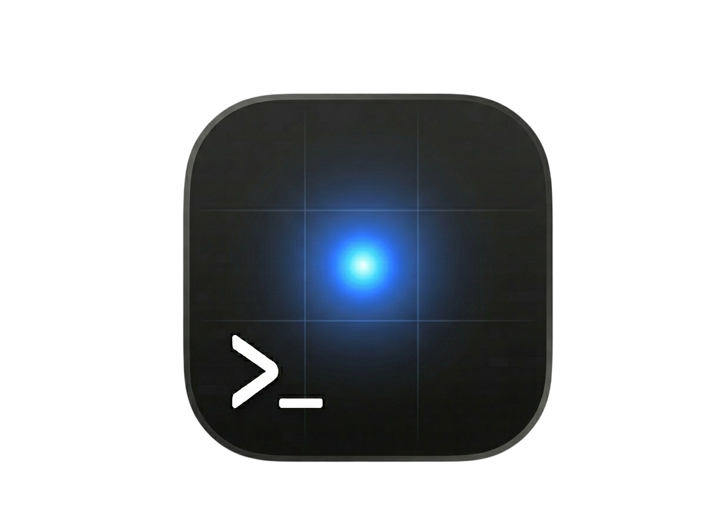

# AI Terminus

<p align="center">
  
</p>

**macOS SSH 終端機，內建 AI 助理。**

AI Terminus 是一款 macOS 原生 SSH 終端機工具，整合多家 AI 模型助理，支援多 Session 九宮格排版、主機群組管理，以及 AI 直接操控遠端終端機。

---

## 主要功能

### SSH 主機管理
- 新增、編輯、刪除、複製 SSH 主機
- 支援密碼與 SSH 私鑰兩種認證方式
- 主機依群組折疊顯示，支援搜尋篩選
- 右鍵選單：連線 / 重新命名 / 複製 / 編輯內容 / 刪除

### 多 Session 終端機
- 同時開啟多個 SSH Session，依數量自動切換排版：
  - 1 個：全螢幕 ┃ 2 個：左右分割 ┃ 3 個：上中下 ┃ 4 個：2×2 ┃ 5+：3×3 九宮格分頁
- 分頁切換（⌘⇧← / ⌘⇧→），切換分頁時 SSH 連線持續保留
- 支援拖曳調整 Session 順序
- 點擊 Session 切換焦點，鍵盤事件直達 SSH PTY

### AI 助理面板
- 支援多家 AI 模型提供者：
  - **Anthropic Claude**（API Key）
  - **OpenAI ChatGPT**（API Key 或 OAuth 登入，免費使用 ChatGPT 帳號）
  - **Google Gemini**（API Key）
  - **Ollama**（本機部署）
- Session 選擇器：指定 AI 分析或控制的目標 Session
- AI 可讀取 Session 終端輸出，提供分析、建議與指令
- `/do` 指令：AI 直接送命令或控制鍵（Ctrl+C 等）到 Session
- `@S1` mention：在對話中引用特定 Session 的上下文
- AI 面板可隨時開啟/隱藏（⌘⇧A）

### 終端機主題
- 8 款內建主題：Midnight、Solarized Dark、Paper Light、Matrix、Ocean Blue、Dracula、Nord、Monokai
- 自訂字體：Menlo、SF Mono、Monaco、Courier Prime
- 可調整字體大小
- 設定即時預覽

### 設定與多語言
- 集中式設定面板：AI Provider、API Key、模型選擇、終端外觀
- 支援繁體中文 / English 介面切換
- API Key 儲存在本機 UserDefaults，不上傳任何地方

### macOS 整合
- 原生 SwiftUI + AppKit 混合架構
- 選單列快捷鍵（關閉 Session、切換分頁、開關 AI 面板）
- 可打包為獨立 `.app` 執行

---

## 系統需求

- macOS 13 (Ventura) 以上
- Xcode 15+ 或 Swift 5.9 toolchain
- 系統已安裝 `/usr/bin/ssh`（macOS 內建）

## 安裝與執行

### 從原始碼建置（Xcode）

```bash
open Package.swift
# 在 Xcode 中按 ⌘R 執行
```

### 從命令列打包成 .app

```bash
./scripts/build-app.sh
open "dist/AI Terminus.app"
```

預設會用你目前機器的原生架構編譯。指定其他架構：

```bash
./scripts/build-app.sh arm64      # Apple Silicon
./scripts/build-app.sh x86_64     # Intel
./scripts/build-app.sh universal  # arm64 + x86_64
```

要安裝到 `/Applications`：

```bash
cp -R "dist/AI Terminus.app" /Applications/
```

### 下載已打包版本

到 [GitHub Releases](https://github.com/JCCJCCTW/AI-Terminus/releases) 下載對應架構的 zip（Apple Silicon 選 `arm64`，Intel Mac 選 `x86_64`）。首次開啟會被 Gatekeeper 擋下，請在 Finder 右鍵 → 開啟 放行一次。

---

## 授權

MIT License. 詳見專案根目錄授權聲明或 Info.plist 版權欄位。

---

## English

**macOS SSH terminal with a built-in AI assistant.**

AI Terminus is a native macOS SSH client that integrates multiple AI providers (Anthropic Claude, OpenAI ChatGPT with OAuth, Google Gemini, local Ollama) with multi-session grid layouts, host group management, and direct AI control over remote terminals.

### Highlights
- Multi-session auto-layout (1 / 2 / 3 / 4 / 3×3 grid with tabs)
- Persistent SSH sessions across tab switches
- AI side panel with per-session targeting, `/do` command execution, and `@S1` mentions
- 8 built-in terminal themes, font family / size options, live preview
- Traditional Chinese and English UI
- API keys stored locally in `UserDefaults` only

### Requirements
- macOS 13 (Ventura) or later
- Xcode 15+ / Swift 5.9 toolchain
- System `/usr/bin/ssh`

### Build

```bash
open Package.swift        # Xcode
./scripts/build-app.sh    # CLI package → dist/AI Terminus.app
```

Prebuilt zips available on [Releases](https://github.com/JCCJCCTW/AI-Terminus/releases). Licensed under MIT.
